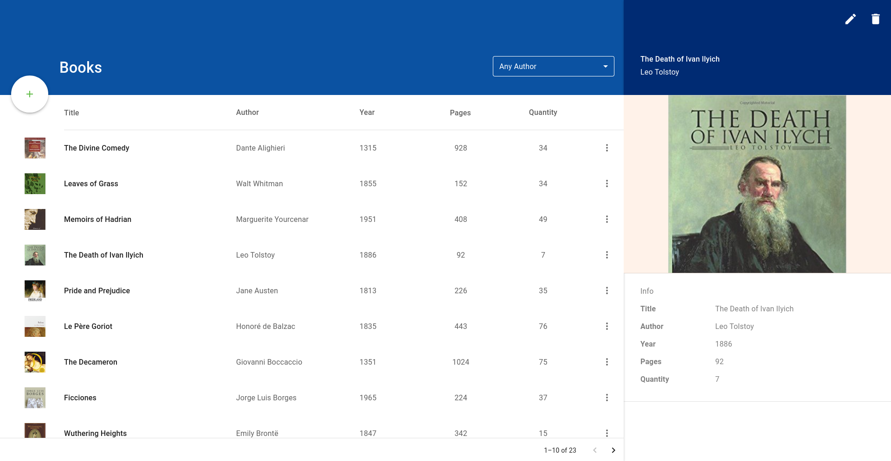
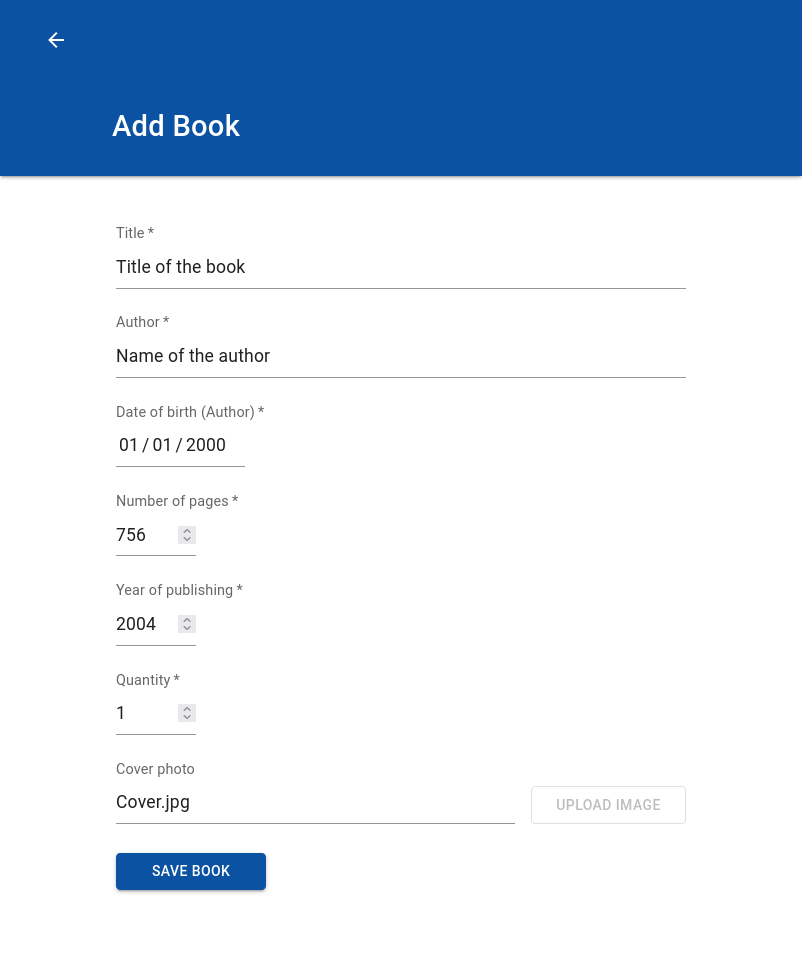

# Books Store

 

Show Add Book Page

 

</detalis>

 

## Tech Stack

&nbsp;
&nbsp;

## IDE

 

## Available Scripts

In the project directory, you can run:

### `npm run install-start`

Installs project dependencies & runs the app in the development mode.\
Open [http://localhost:3000](http://localhost:3000) to view it in the browser.\
The page will reload if you make edits.\
You will also see any lint errors in the console.

### `npm run build-watch`

Runs the app in the production mode.\
Open [http://localhost:3000](http://localhost:3000) to view it in the browser.

### `npm test`

Launches the test runner in the interactive watch mode.

 

## Pages

### 1. Page - Table with books support

- Filtering book by
  author’s name, where author is chosen from a `<Select/>` component
- Sorting by title and number of pages
- Pagination
- Preview of selected book which is visible when book is selected with `Edit Quantity` and `Delete` buttons.

### 2. Page - Adding new book

- Form fields to add new book, where every `<input/>` element have specified `type` attribute and is validated before adding new book. All fields are required except `Cover photo`, which is read-only.

 

## Tests

One unit and snapshot test is included in `__tests__` folder.

 

## Styling

- Responsive for all screen sizes, **mobile too**
- `MUI` components customized with CSS to match design
- Fluid typography

 

## Semantics

<!-- - used right `HTML` tags -->

<table>
  <thead>
    <tr>
      <td style='font-weight:bold;'>HTML Elements</td>
      <td style='font-weight:bold;'>Usage</td>
    </tr>
  </thead>
  <tbody>
    <tr>
      <td>
        <code>header</code>
      </td>
      <td>Header with <code>h1</code> title and custom MUI <code>select</code> and <code>button</code> elements</td>
    </tr>
    <tr>
      <td>
        <code>table</code>
      </td>
      <td>Main table view with <code>thead</code> & <code>tbody</code></td>
    </tr>
    <tr>
      <td>
        <code>main</code>
      </td>
      <td>Container for <code>header</code> & <code>table</code></td>
    </tr>
    <tr>
      <td>
        <code>aside</code>
      </td>
      <td>Book preview</td>
    </tr>
    <tr>
      <td>
        <code>article, dl, dt, dd</code>
      </td>
      <td>Book info</td>
    </tr>
    <tr>
      <td>
        <code>form, input[type='*']</code>
      </td>
      <td>Form fields with validation</td>
    </tr>
     <tr>
      <td>
        ...</code>
      </td>
      <td><small><i>Other semantic elements can be seen in source code (files with <code>.tsx</code> extension)</i>.</small></td>
    </tr>
  </tbody>
</table>
